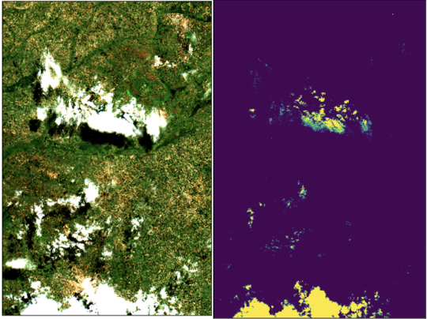

# Project Summary

- [Problem Statement](#Problem-Statement)
- [Project Goals](#Project-Goals)
- [Data Description](#Data)
- [Data Preprocessing](#Data-Preprocessing)
- [Feature Engineering](#Feature-Engineering)
- [Modeling & Results](#Modeling-and-Results)
- [Major Challenges](#Major-Challenges)
- [Next Steps](#Next-Steps)
- [Final Thoughts](#Final-Thoughts)

## Problem Statement

An in-depth description of the problem can be found on [Zindi](https://zindi.africa/competitions/iclr-workshop-challenge-2-radiant-earth-computer-vision-for-crop-recognition)

## Project Goals

I have a keen interest in merging my interests in Ecology,  Satellite Imagery, and Machine Learning through my data science projects. This competition provided a fresh opportunity to work with a new multi-spectral and time series imagery data source that would present unique analysis and modeling challenges. Additionally,  this project allowed an opportunity to think about new ways to write code for analysis and model development. Thus, my goals for the project were as follows:

1. Analyze and model a new data set and problem that allowed for several different approaches (i.e. deep learning or classical ML, time series analysis and multi-spectral remote sensing), some which do not require cloud computing resources.
2. Write functional, high-performant, reproducible code that can be executed from the command line (python scripts vs. Jupyter Notebooks). Create a development environment that allows my project to be easily shared and reproduced (Docker vs. Anaconda).
3. This project has implications for Climate Change, Food Sovereignty, and the UN's Sustainable Development Goals, allowing critical thinking about the impact of my data science work on the land and the communities that land supports.

## Data

The raw data consists of four Sentinel-2 land-swathes, with 13 temporal layers from the growing season captured on the following dates:
    - 2019-07-01, 2019-07-06, 2019-07-11, 2019-07-21, 2019-08-05, 2019-08-15, 2019-08-25, 2019-09-09, 2019-09-19, 2019-09-24, 2019-10-04, 2019-11-03

_Due to the irregularities in the time series, it is important to note that the models developed for this competition likely would not generalize well to data that does not share the same time-series sequence._

**Band Resolution** 


**[More info](https://sentinel.esa.int/web/sentinel/user-guides/sentinel-2-msi/resolutions/radiometric)**

Also included in the data is a derived cloud probability layer. For simplicity sake, I treated all nonzero cloud probability values as _cloudy_.

## Data Preprocessing

Using the label and field_id `tif` files from each scene, I extracted only pixels that belong to labeled training and test fields. This greatly reduced the dimensionality of the data -- we would only be using field pixels in model training -- thus allowing a classical machine learning approach and minimal hardware requirements to solve the problem.

## Feature Engineering

I derived the following Remote Sensing Indices for each date as features for modeling:

- NDVI: Normalized Difference Vegetation Index
- NirV: Near-Infrared of Vegetation
- NDWI: Normalized Difference Water Index
- EVI: Enhanced Vegetation Index
- SAVI: Soil Adjusted Vegetation Index
- CiG: Chlorophyll Index - Green

Statistical features (i.e. mean, min, max, median, standard deviation) were also calculated per pixel across each of the original bands and derived features. Pixels with above 0 derived cloud probability values were excluded from statistics calculations to reduce noise.

## Modeling and Results

Model development allowed for testing of a range of data aggregation, ML algorithms and hyperparameter combinations, and feature sets. 

The best performing models were trained on aggregated field data. For instance, if a given field contains 10 pixels of data, each feature (band or derived index at a given data) would be averaged across every pixel in that field. This reduces training time as well, as the number of training samples decreased by an order of magnitude.

I experimented with bootstrapping to over-sample the minority classes to the number of samples of the majority class, along with class weights to adjust weighting of classes when calculating information gain within the model. However, neither of these distribution modifications improved local Cross Validation or competition test scores, likely due to the overall imbalance of classes in both the training and test datasets. Models trained on re-weighted or bootstrapped data learn in a sort of zero-sum game, where gains in learning the less abundant classes come at a cost of learning the more common classes.

My best result on the Zindi private leaderboard was a log-loss of 1.2559, with a local Cross Validation score of 1.1358 (mean of 5 splits, std. dev. = 0.0413), The private leaderboard score is likely on a subsample that is somewhat skewed from the splits used for Cross Validation. For instance, log-loss on individual splits ranged from 1.1024 to 1.2122.

The above result was obtained using the following training parameters:

- Model: Random Forest
    - Bootstrap: False
    - All other  parameters set to default.
- Number of estimators: 2000
- Random State: 123
- Field Aggregated Data: True
- Class Weights: True
- Bootrapping (up-sampled minority classes) : False

To reproduce this solution with cross validation:

```
python3 main.py -cv -fd -md RandomForest -ne 2000 -rs 123 -cw
```

## Major Challenges

1. **Dimensionality**

    - Due to the temporal component of the data, the dimensionality was increased by a factor of 13. With the addition of the remote sensing indices and statistical features, this resulted in greater than 350 features. This made it difficult to sort through features, prune features, and find clear patterns to delineate classes from one another during exploratory data analysis. 

2. **Data Distribution**

    - In most real-world data sets, especially in multi-class classification problems, it is expected to have some class imbalance. This is magnified in the case of the 7 classes present in this data set. Maize - the majority class - made up 44% of the individual fields, while inter-cropped Cassava and Common Bean fields made up just 2.37% of the data. Likewise, the presence of separate Cassava and Common Bean fields - and no statistics about the proportion of each crop in the mixed field class - would make distinction between this classes dubious. This would require in-depth analysis of the data and tinkering with data distribution to alleviate the challenges of the class imbalance.

3. **Noise in the data**

    - As mentioned above, the presence of classes in the data that were an unspecified combination of the other classes adds a degree of noise to the data, and we can in no way attribute the pixel-level image values to a specific land-surface feature.  
    
    - A second source of noise is the presence of clouds. Many pixels are given a modeled cloud-probability value, which is present for each time-series capture as it's own image channel. Due to inconsistencies in the cloud prediction, I treated all pixels with greater than zero cloud prob. as cloudy. However, without a robust imputation strategies for cloudy pixels, removing observations with clouds on any date would greatly reduce the amount of training data. Thus, the cloudy pixels were included in training and contribute obvious noise. 
    
    - Aside from the known cloudy pixels, comparison of the cloud probability layer with true color images indicate clear blindspots to the cloud modeling, as the cloud mask misses large cloudy sections, as well as cloud shadows. All of these increase noise in the data. As the adage goes: _Garbage in: garbage out!_



4. **How to treat individual observations**

    - The problem calls for predictions to be made of crop type for a given field. However, based on my data extraction methods, observations could either be treated as individual pixels of a field, or aggregated together as one observation. A model could be trained on aggregate data, or aggregated after predictions. Earlier in the model and code development, it was unclear whether pre- or post-prediction data aggregation was better for model performance. This meant that pre-processing methods might need to be able to handle both pixel and field-level data, whcih requiring additional investment in code development. For example, without specifying a training-validation splitting criterion, pixels from the same field could end up in both training and validation sets, resulting in leaked data and meaningless validation scoring. Likewise, scoring on the pixel-level vs. field-level had vastly different results. It was pertinent to resolve this issue to have accurate cross-validation scores to compare to scores on the Zindi platform. Without care, it was easy for inconsistencies in the pre-processing and scoring methodology to leak out. 

5. **Resource Requirements**

    - As always, often the best machine learning solutions require steep hardware requirements and financial investment. Many solutions on the leaderboard combined a weighted or stacked ensemble of ensemble learners or required GPU hardware. Due to my constraints, I was mostly limited to algorithms with lower computation complexity, like RandomForest. Additionally, with only local computing resources, advanced hyperparameter tuning was unrealistic. Hence, why I created a training script that allows for some flexibility.

## Next Steps

1. **Deep Learning**

    - As evidenced by the [winning solution](https://zindi.africa/competitions/iclr-workshop-challenge-2-radiant-earth-computer-vision-for-crop-recognition/discussions/1147), a deep learning approach works very well for this problem. Likely, the inclusion of boarding pixels helps delineate and contextualize the fields in relationship to their surroundings. A deep learning approach will also elucidate implicit textural features in the images and create an increased representation space of image features due to the large number of model parameters. With the right hardware, deep learning is making being proven to work on problems in an impressive diversity of domains.
2. **Remote Sensing Indices**
    
    - A future approach to this project might build upon a similar solution as above, however utilizing a refined number of derived remote sensing indices. As shown by the feature importance results in my solution, derived feature statistics were commonly recorded with the highest feature importance values in multiple random forest models.

3. **Improve Cloud-Probability Prediction & No-data imputation**
    
    - As discussed in the Noise section of the Major Challenges, there were clear issues with the cloud-probability values. The model used to estimate cloud prediction could certainly be improved, along with robust methods to impute cloudy pixels. For example, using a linear interpolation method to fill cloudy pixels might reduce noise compared to including cloudy values.

4. **Date Agnostic Approach**
    
    - Due to the irregular time series included in the training data, the models made from this data are not generalizable for prediction or inference on unseen data. A similar approach could be applied to future data, but a new model would need to be trained. A future approach might use some date-agnostic approach. A deep learning model architecture with flexible time-series functionality (e.g. LSTM/GRU on images with variable time series captures) could work best.

5. **In-depth Model Evaluation Features**

    - In any ML problem, robust evaluation of model results, but especially with a complex, multi-class data set, is pertinent. Due to the slow and sometimes clunky experience of this newer-to-me workflow, I did not implement features for robust model evaluation. An ideal codebase would include script parameters for model evaluation, via confusion matrices, evaluation of target class distribution on each cross validation split, and evaluation of feature importance values for each CV split. All of these evaluation elements would aid in making refined and informed changes to the training data distribution, feature space, and model hyper-parameters.

6. **Scalable/ Distributable Model Training with Kubernetes and Kubeflow**

    - Docker integrates well with DevOps tools like Kubernetes and Kubeflow. With some modifications, the code in this repository could be used to train many hyperparameter combinations across a cluster of computers. Docker containers could be configured to document in depth model evaluations for each training run to find an optimal set of hyperparameters. Similar tools can be used for model inference after training.

## Final Thoughts

As with any project, time and cost constraints will always be present. It's always worthwhile to walk away from a project having documented what I did and what I would do next! This project was challenging, for the many reasons explained above, and for the challenges I laid out for myself. While writing code outside of a notebook and using libraries like `argparse` to create scripts with a flexible set of parameter combinations is new and slow, the investment in engineering these systems is huge for model development, testing, documentation, and overall progress in doing data science. Creating a system that enables reproducibility will ensure that our work is repeatable, and therefore ensure that the work is grounded in the scientific method. On that vain, implementing my project in a shareable `Docker` container is another step to enable the science of the work. I'm excited to take the learnings from this project to my future work.
